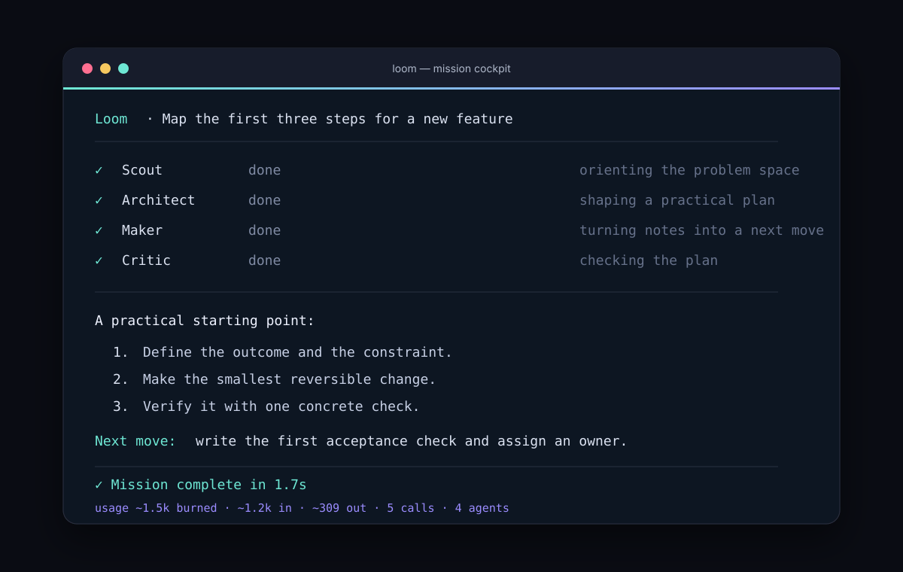

# Loom CLI

<p align="center">
  <strong>A beautiful, terminal-first command cockpit for multi-agent work.</strong><br>
  Turn an ambiguous request into a useful next move—with specialists, context safety, persistent transcripts, and transparent token usage.
</p>

<p align="center">
  <a href="https://github.com/prriyamm/loom-cli/actions"></a>
  <a href="https://github.com/prriyamm/loom-cli/blob/main/LICENSE"></a>
  <a href="https://nodejs.org"></a>
</p>

Loom is a small, dependency-free CLI for thinking with a team of agents. It is intentionally its own thing: a calm mission cockpit instead of a clone of an existing coding interface. A default mission moves through Scout, Architect, Maker, and Critic before a lead synthesizer gives you one clear answer.

## See it in action

### Start Loom


### Run a mission



The visuals above are captured representations of real Loom output in demo mode. Demo mode is local, deterministic, and available immediately after installation—no API key required.

## Install

### From GitHub

Requires Node.js 20 or newer.

```bash
npm install --global github:prriyamm/loom-cli
loom --help
```

### From a local checkout

```bash
git clone https://github.com/prriyamm/loom-cli.git
cd loom-cli
npm install
npm link
loom --help
```

For a one-off local install, use `npm install --global .` instead of `npm link`.

## Quick start

```bash
loom "Design a migration plan from REST to event-driven jobs"
```

That works immediately in demo mode. For live responses, point Loom at any OpenAI-compatible provider:

```bash
# PowerShell
$env:OPENAI_API_KEY = "your-key"

# macOS / Linux
export OPENAI_API_KEY="your-key"

loom "Review the architecture in this repository"
```

Loom reads `LOOM_API_KEY`, `LOOM_BASE_URL`, and `LOOM_MODEL` too. Your key is never printed in diagnostics or saved transcripts.

## Features

- **A distinctive terminal cockpit** with agent lanes, run status, handoff notes, streaming answers, and a persistent footer.
- **Four-stage orchestration**: Scout and Architect orient in parallel, Maker drafts, and Critic reviews before lead synthesis.
- **Parallel mode** with `--parallel` for lower latency while preserving each specialist’s role and telemetry.
- **Focused teams** with `--team=scout,critic` when a smaller, intentional run is all you need.
- **Custom agent stages** through project configuration.
- **OpenAI-compatible providers** using the standard `/chat/completions` endpoint, streaming, retries, backoff, timeouts, and cancellation.
- **Local demo provider** so the CLI is useful without credentials or network access.
- **Transparent usage accounting** for input, output, total tokens burned, provider calls, estimates, and per-model totals.
- **Saved mission transcripts** under `.loom/sessions/`, with metadata, agent notes, model provenance, and usage ledgers.
- **History and recovery** with `history`, `show`, `resume`, and unique ID prefixes.
- **Markdown and JSON export** for sharing, archiving, or feeding another tool.
- **Structured automation output** through `--json` and newline-delimited `--events`.
- **Interactive cockpit mode** with `/agents`, `/history`, `/usage`, `/context`, `/team`, `/show`, `/export`, `/help`, and `/quit`.
- **Bounded workspace context** that respects `.gitignore`, skips common secret files, clips by UTF-8 bytes, and redacts sensitive values.
- **Explicit diff context** with `--diff`; normal missions only receive Git status and diff statistics.
- **Context controls** through `--include`, `--no-context`, `context.enabled`, and interactive `/context on|off`.
- **Piped missions** such as `Get-Content brief.md | loom -` or `cat brief.md | loom -`.
- **Shell completions** for Bash, Zsh, and PowerShell.
- **Safe diagnostics** through `doctor`, `config`, and `init`.
- **Graceful cancellation** with Ctrl+C and a recorded cancellation event.
- **No runtime dependencies** beyond Node.js, keeping installation fast and auditable.

## Command guide

```text
loom "mission"                 Run a mission through all specialists
loom run "mission"             Explicit run form
loom review "change"           Review with bounded Git diff context
loom brainstorm "idea"         Get parallel specialist perspectives
loom interactive                Open the multi-mission cockpit
loom agents                     Show the specialist roster
loom history                    List saved missions
loom usage                      Aggregate saved token usage
loom stats                      Show usage statistics
loom show <id>|last             Reopen a saved mission
loom export <id>|last           Print or write a mission transcript
loom resume <id>|last "…"       Continue from a saved mission
loom context                    Preview bounded workspace context
loom config                     Show effective safe configuration
loom doctor                     Check provider and local setup
loom init                       Create loom.config.json
loom completions <shell>        Print bash, zsh, or powershell completion
```

Useful global options:

```text
--json                          Return machine-readable output
--events                        Stream newline-delimited JSON events
--no-save                       Keep the run local
--no-context                    Skip workspace excerpts
--include=src/app.js,README.md  Prioritize exact files
--diff                          Include bounded, redacted Git diff
--parallel                      Run the selected team in one wave
--team=scout,critic             Choose a focused team
--trace                         Show specialist notes
--no-stream                     Disable provider streaming
--stream-usage                  Request exact usage for streamed calls
--model=<name>                  Override the model
--base-url=<url>                Override the provider endpoint
--max-tokens=<n>                Cap one provider response
--config=<path>                 Use an explicit project profile
```

Examples:

```bash
loom --team=scout,critic "Is this API change safe to ship?"
loom --parallel --trace "Compare two approaches to caching"
loom --json "Summarize the release risks" > result.json
loom --events "Plan the migration" > events.ndjson
loom review "the current uncommitted changes"
loom context --include=src,README.md
loom export last --output=mission.md
loom export last --format=json --output=mission.json
Get-Content brief.md | loom -
```

## Usage footer

Every completed mission ends with a compact accounting line:

```text
✓ Mission complete in 1.7s
usage ~1.5k burned · ~1.2k in · ~309 out · 5 calls · 4 agents
```

Provider-reported usage is exact. Demo mode and providers that omit usage metadata use a conservative character-based estimate and prefix approximate values with `~`. Review aggregate usage at any time:

```bash
loom usage --json
loom stats --json
```

## Configuration

Create a project profile with:

```bash
loom init
```

Example `loom.config.json`:

```json
{
  "model": "gpt-4o-mini",
  "baseUrl": "https://api.openai.com/v1",
  "agents": ["scout", "architect", "maker", "critic"],
  "strategy": "staged",
  "streaming": true,
  "context": {
    "enabled": true,
    "maxFiles": 24,
    "maxBytes": 50000,
    "include": ["src", "README.md"]
  }
}
```

Configuration can also be supplied with environment variables or command-line flags. An explicitly supplied `--config` path must exist; Loom reports a clear error instead of silently falling back to defaults.

## Context and privacy

Loom’s context collector is deliberately bounded. It discovers useful text files inside the current workspace, follows common `.gitignore` rules, ignores binary and secret-looking paths, clips large files, and redacts API-key-like values. Git diff content is opt-in with `--diff`.

Use `--no-context` when a mission should not inspect local files. Use `--include` to make the intended scope explicit. Always review provider and organization policies before sending proprietary source code to a remote model.

## Development

```bash
npm install
npm test
npm start -- "Try Loom locally"
```

The test suite runs with Node’s built-in test runner. There are no runtime dependencies and no build step.

## License

Loom CLI is released under the [MIT License](LICENSE).

## Contributing

Issues and pull requests are welcome at [github.com/prriyamm/loom-cli](https://github.com/prriyamm/loom-cli). Please include the command you ran, Node.js version, provider mode, and a minimal reproduction when reporting a bug. Never include API keys or private source code in an issue.
