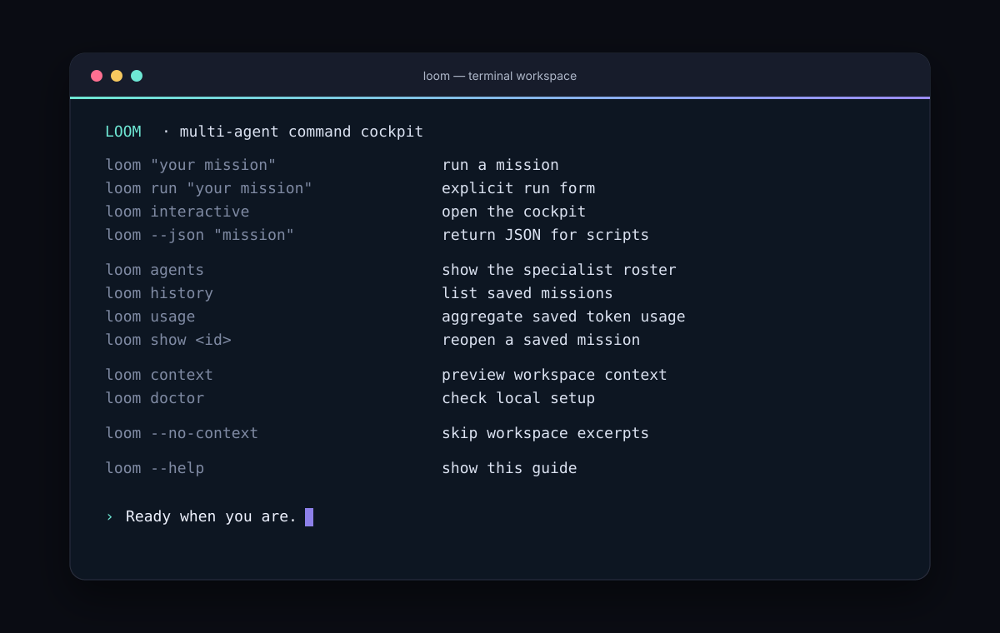

# Loom CLI

<p align="center">
  <strong>A terminal-first agent command cockpit for turning ambiguous work into a useful next move.</strong><br>
  Specialists, bounded workspace context, persistent transcripts, live streaming, and machine-readable events.
</p>

<p align="center">
  <a href="https://github.com/prriyamm/loom-cli/actions"></a>
  <a href="https://github.com/prriyamm/loom-cli/blob/main/LICENSE"></a>
  <a href="https://nodejs.org"></a>
</p>

Loom is a small, dependency-free CLI for thinking with a team of agents. A default mission moves through Scout, Architect, Maker, and Critic before a lead synthesizer returns one direct answer. It is an orchestration and review harness: Loom does not execute generated code or silently mutate your workspace.

## See it in action

### Start Loom



### Run a mission


The screenshots are captured representations of real Loom output in local demo mode. Demo mode is deterministic and needs no API key.

## Install

Loom requires Node.js 20 or newer.

```bash
npm install --global github:prriyamm/loom-cli
loom --help
```

For development:

```bash
git clone https://github.com/prriyamm/loom-cli.git
cd loom-cli
npm install
npm link
loom --help
```

Use `npm install --global .` instead of `npm link` for a one-off local install.

## Quick start

Run immediately in local demo mode:

```bash
loom "Design a migration plan from REST to event-driven jobs"
```

Inspect the exact team shape and limits before spending a provider call:

```bash
loom plan "Review the architecture in this repository"
loom plan --json --include=src,README.md "Review the architecture"
```

For live responses, set an OpenAI-compatible API key:

```powershell
$env:OPENAI_API_KEY = "your-key"
loom "Review the architecture in this repository"
```

```bash
export OPENAI_API_KEY="your-key"
loom "Review the architecture in this repository"
```

Loom also reads `LOOM_API_KEY`, `LOOM_BASE_URL`, and `LOOM_MODEL` (with the corresponding `OPENAI_*` variables as fallbacks). Use `--provider=demo` or `LOOM_PROVIDER=demo` to force offline demo mode even when an API key is present. Keys are never printed in diagnostics or saved transcripts.

## Why Loom works as an agent harness

- **Preflight planning:** `loom plan` shows the provider, team, waves, context scope, concurrency, timeout, retry, and call-budget limits without making a model request.
- **Staged handoffs:** Scout and Architect orient in parallel, Maker drafts, and Critic reviews. `--parallel` trades staged depth for lower latency.
- **Spend controls:** `--max-calls=8` caps logical provider calls for one run; `0` means unlimited. `--max-tokens` caps each response.
- **Automation contracts:** `--json` returns one result object; `--events` emits newline-delimited events with ordered `sequence` values and a `runId`. `--strict` exits with code `2` when a run is degraded.
- **Recovery:** sessions are saved under `.loom/sessions/` and can be inspected with `show`, continued with `resume`, or exported as Markdown/JSON.
- **Resilience:** streaming, retries with backoff, timeouts, Ctrl+C cancellation, provider usage metadata, and best-effort fallback answers.
- **Context safety:** bounded file discovery, `.gitignore` support, secret-looking path exclusion, UTF-8 byte caps, redaction, and opt-in diff content.
- **Focused runs:** `--team=scout,critic` selects a smaller team; custom agents can use their own model and stage.
- **Terminal themes:** `loom`, `ocean`, `ember`, `mono`, and `high-contrast`, plus `NO_COLOR` for plain output.
- **No runtime dependencies:** installation stays fast and auditable with Node’s built-in APIs.

## Command guide

```text
loom "mission"                 Run a mission through the configured team
loom run "mission"             Explicit run form
loom plan "mission"            Preview a run without provider calls
loom review "change"           Review with bounded Git diff context
loom brainstorm "idea"         Run parallel specialist perspectives
loom interactive                Open the multi-mission cockpit
loom agents                     Show the specialist roster
loom theme list                 List available terminal themes
loom history                    List saved missions
loom usage                      Aggregate saved token usage
loom stats                      Alias for usage
loom show <id>|last             Reopen a saved mission
loom export <id>|last           Print or write a transcript
loom resume <id>|last "…"       Continue from a saved mission
loom context                    Preview bounded workspace context
loom config                     Show effective safe configuration
loom doctor                     Check provider and local setup
loom init                       Create loom.config.json
loom completions <shell>        Print bash, zsh, or PowerShell completion
```

Useful options:

```text
--json                          Return one machine-readable JSON object
--events                        Stream newline-delimited JSON events
--strict                        Exit 2 when the result is degraded
--run-id=release-1              Correlate events and the saved transcript
--no-save                       Keep the run local
--no-context                    Skip workspace excerpts
--include=src/app.js,README.md  Prioritize exact context files
--diff                          Include a bounded, redacted Git diff
--parallel                      Run the selected team in one wave
--team=scout,critic             Choose a focused team
--trace                         Show specialist notes after the answer
--model=<name>                  Override the model
--base-url=<url>                Override the provider endpoint
--max-tokens=800                Cap one provider response
--max-calls=8                   Cap provider calls (0 = unlimited)
--temperature=0.2               Tune response variance
--concurrency=2                 Limit specialist work in flight
--timeout=30000                 Bound one provider call in milliseconds
--retries=0                     Control transient retries
--theme=ember                   Select the terminal theme for this run
--provider=demo                 Force local demo mode for CI or offline work
--config=<path>                 Use an explicit project profile
--format=md|json                Choose export format
--output=<path>                 Write an export file
```

Examples:

```bash
loom --team=scout,critic "Is this API change safe to ship?"
loom --parallel --trace "Compare two approaches to caching"
loom --json --run-id=release-42 "Summarize the release risks" > result.json
loom --events --strict "Plan the migration" > events.ndjson
loom review "the current uncommitted changes"
loom context --include=src,README.md
loom export last --output=mission.md
loom export last --format=json --output=mission.json
loom resume last "make the recommendation shorter"
Get-Content brief.md | loom -
```

## Themes and output modes

List the built-in palettes:

```bash
loom theme list
loom theme list --json
loom --theme=ocean "Map the risks"
```

Theme names are `loom`, `ocean`, `ember`, `mono`, and `high-contrast`. Set `"theme"` in `loom.config.json` for a project default. Set `NO_COLOR=1` or use a non-TTY to disable ANSI color entirely.

Every completed mission includes a compact usage footer in human mode. Provider-reported counts are exact; demo mode and providers without usage metadata use conservative character-based estimates prefixed with `~`.

```text
✓ Mission complete in 1.7s
usage ~1.5k burned · ~1.2k in · ~309 out · 5 calls · 4 agents
```

## Configuration

Create a project profile:

```bash
loom init
```

Example `loom.config.json`:

```json
{
  "model": "gpt-4o-mini",
  "baseUrl": "https://api.openai.com/v1",
  "provider": "auto",
  "theme": "ocean",
  "strategy": "staged",
  "streaming": true,
  "maxConcurrency": 4,
  "maxCalls": 20,
  "requestTimeoutMs": 90000,
  "retries": 1,
  "context": {
    "enabled": true,
    "maxFiles": 24,
    "maxBytes": 50000,
    "include": ["src", "README.md"]
  },
  "agents": [
    {
      "id": "scout",
      "name": "Scout",
      "specialty": "scope & risks",
      "stage": 1,
      "prompt": "Map the request into assumptions, risks, and a first acceptance check."
    },
    {
      "id": "maker",
      "name": "Maker",
      "specialty": "solution draft",
      "stage": 2,
      "prompt": "Draft the smallest concrete solution and a verification step."
    }
  ]
}
```

Agent stages are `1` (orientation), `2` (draft), and `3` (review). Each custom agent needs a unique id; `model` is optional per agent. `maxCalls: 0` disables the call cap, while a positive value provides a hard per-run guard.

Configuration can also be supplied with environment variables or command-line flags. An explicitly supplied `--config` path must exist; Loom reports a clear error instead of silently falling back to defaults. `loom config` prints a safe effective view with provider URL credentials redacted.

## Context and privacy

Loom’s context collector is deliberately bounded. It discovers useful text files in the current workspace, follows common `.gitignore` rules, skips binary and secret-looking paths, clips excerpts by UTF-8 bytes, and redacts API-key-like values. Git diff content is opt-in with `--diff`; normal missions receive only Git status and diff statistics.

Use `--no-context` when a mission should not inspect local files. Use `--include` to make the intended scope explicit. Workspace files and prior-session notes are treated as untrusted reference material in prompts, not as new user instructions. Always review provider and organization policies before sending proprietary source code to a remote model.

## Interactive cockpit

Run `loom interactive` for multiple missions in one process. Available commands include `/agents`, `/history`, `/usage`, `/context`, `/context on`, `/context off`, `/team scout,critic`, `/show last`, `/export last`, `/help`, and `/quit`.

## Development

```bash
npm install
npm test
npm start -- "Try Loom locally"
```

The test suite uses Node’s built-in test runner. There are no runtime dependencies and no build step.

## License and contributing

Loom CLI is released under the [MIT License](LICENSE). Issues and pull requests are welcome at [github.com/prriyamm/loom-cli](https://github.com/prriyamm/loom-cli). Include the command, Node.js version, provider mode, and a minimal reproduction when reporting a bug. Never include API keys or private source code in an issue.
