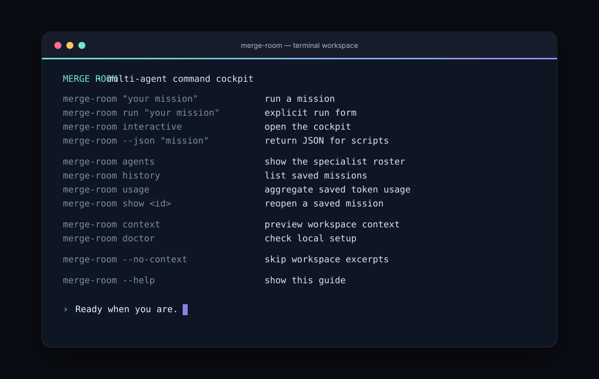
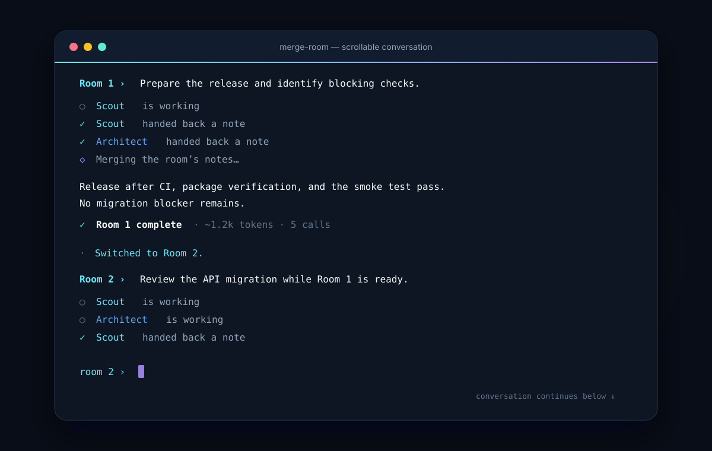

# Merge Room CLI

<p align="center">
  <strong>A terminal-first agent command cockpit for turning ambiguous work into a useful next move.</strong><br>
  Specialists, bounded workspace context, persistent transcripts, live streaming, and machine-readable events.
</p>

<p align="center">
  <a href="https://github.com/prriyamm/merge-room-cli/actions"></a>
  <a href="https://github.com/prriyamm/merge-room-cli/blob/main/LICENSE"></a>
  <a href="https://nodejs.org"></a>
</p>

Merge Room is a small, dependency-free CLI for thinking with a team of agents. A default mission moves through Scout, Architect, Maker, and Critic before a lead synthesizer returns one direct answer. It is an orchestration and review harness: Merge Room does not execute generated code or silently mutate your workspace.

## See it in action

### Start the cockpit



### Keep two conversations moving



The screenshots are captured representations of real Merge Room output in local demo mode. Demo mode is deterministic and needs no API key.

## Install

Merge Room requires Node.js 20 or newer.

```bash
npm install --global github:prriyamm/merge-room-cli
merge-room
```

For development:

```bash
git clone https://github.com/prriyamm/merge-room-cli.git
cd merge-room-cli
npm install
npm link
merge-room
```

Use `npm install --global .` instead of `npm link` for a one-off local install.

## Quick start

Open the conversational cockpit in local demo mode:

```bash
merge-room
```

The angular twin-rail mark appears once at startup. From then on, prompts, handoffs, and answers append to normal terminal history, so the conversation scrolls naturally instead of repainting the screen.

Run a one-off mission without opening the cockpit:

```bash
merge-room "Design a migration plan from REST to event-driven jobs"
```

Inspect the exact team shape and limits before spending a provider call:

```bash
merge-room plan "Review the architecture in this repository"
merge-room plan --json --include=src,README.md "Review the architecture"
```

For live responses, set an OpenAI-compatible API key:

```powershell
$env:OPENAI_API_KEY = "your-key"
merge-room "Review the architecture in this repository"
```

```bash
export OPENAI_API_KEY="your-key"
merge-room "Review the architecture in this repository"
```

Merge Room also reads `MERGE_ROOM_API_KEY`, `MERGE_ROOM_BASE_URL`, and `MERGE_ROOM_MODEL` (with the corresponding `OPENAI_*` variables as fallbacks). Use `--provider=demo` or `MERGE_ROOM_PROVIDER=demo` to force offline demo mode even when an API key is present. Keys are never printed in diagnostics or saved transcripts.

## Why Merge Room works as an agent harness

- **Preflight planning:** `merge-room plan` shows the provider, team, waves, context scope, concurrency, timeout, retry, and call-budget limits without making a model request.
- **Staged handoffs:** Scout and Architect orient in parallel, Maker drafts, and Critic reviews. `--parallel` trades staged depth for lower latency.
- **Spend controls:** `--max-calls=8` caps logical provider calls for one run; `0` means unlimited. `--max-tokens` caps each response.
- **Automation contracts:** `--json` returns one result object; `--events` emits newline-delimited events with `schemaVersion: 1`, ordered `sequence` values, and a `runId`. `--strict` exits with code `2` when a run is degraded.
- **Recovery:** sessions are saved under `.merge-room/sessions/` and can be inspected with `show`, continued with `resume`, or exported as Markdown/JSON.
- **Resilience:** streaming, retries with backoff, timeouts, Ctrl+C cancellation, provider usage metadata, and best-effort fallback answers.
- **Context safety:** bounded file discovery, `.gitignore` support, secret-looking path exclusion, UTF-8 byte caps, redaction, and opt-in diff content.
- **Workspace targeting:** `--cwd <path>` or `-C <path>` runs against another project without changing the caller's shell directory. Config, context, history, and exports stay anchored to that workspace.
- **Reusable missions:** `--prompt-file <path>` reads a reviewed, version-controlled mission file from the selected workspace, with clear empty-file, ambiguity, and size-limit errors.
- **Focused runs:** `--team=scout,critic` selects a smaller team; custom agents can use their own model and stage.
- **Terminal themes:** ten built-in palettes, including subtle `liquid-glass`, `graphite`, `sage`, `dusk`, and `champagne` options, plus `NO_COLOR` for plain output.
- **No runtime dependencies:** installation stays fast and auditable with Node’s built-in APIs.

## Command guide

```text
merge-room                           Open the conversational cockpit
merge-room "mission"                 Run a mission through the configured team
merge-room run "mission"             Explicit run form
merge-room plan "mission"            Preview a run without provider calls
merge-room review "change"           Review with bounded Git diff context
merge-room brainstorm "idea"         Run parallel specialist perspectives
merge-room interactive                Alias for the conversational cockpit
merge-room agents                     Show the specialist roster
merge-room theme list                 List available terminal themes
merge-room history                    List saved missions
merge-room usage                      Aggregate saved token usage
merge-room stats                      Alias for usage
merge-room show <id>|last             Reopen a saved mission
merge-room export <id>|last           Print or write a transcript
merge-room resume <id>|last "…"       Continue from a saved mission
merge-room context                    Preview bounded workspace context
merge-room config                     Show effective safe configuration
merge-room doctor                     Check provider and local setup
merge-room init                       Create merge-room.config.json
merge-room completions <shell>        Print bash, zsh, or PowerShell completion
```

Useful options:

```text
--json                          Return one machine-readable JSON object
--events                        Stream newline-delimited JSON events
--strict                        Exit 2 when the result is degraded
--run-id=release-1              Correlate events and the saved transcript
--no-save                       Keep the run local
--no-context                    Skip workspace excerpts
--cwd=<path>, -C <path>         Target another workspace
--prompt-file=<path>            Read the mission from a UTF-8 text file
--include=src/app.js,README.md  Prioritize exact context files
--diff                          Include a bounded, redacted Git diff
--parallel                      Run the selected team in one wave
--team=scout,critic             Choose a focused team
--trace                         Show specialist notes after the answer
--model=<name>                  Override the model
--base-url=<url>                Override the provider endpoint
--max-tokens=800                Cap one provider response
--max-calls=8                   Cap provider calls (0 = unlimited)
--temperature=0.2               Tune response variance
--concurrency=2                 Limit specialist work in flight
--timeout=30000                 Bound one provider call in milliseconds
--retries=0                     Control transient retries
--theme=ember                   Select the terminal theme for this run
--provider=demo                 Force local demo mode for CI or offline work
--config=<path>                 Use an explicit project profile
--format=md|json                Choose export format
--output=<path>                 Write an export file
```

Examples:

```bash
merge-room --team=scout,critic "Is this API change safe to ship?"
merge-room --parallel --trace "Compare two approaches to caching"
merge-room --json --run-id=release-42 "Summarize the release risks" > result.json
merge-room --events --strict "Plan the migration" > events.ndjson
merge-room review "the current uncommitted changes"
merge-room -C ../another-project plan "Map the safest first change"
merge-room --prompt-file missions/release-review.md
merge-room context --include=src,README.md
merge-room export last --output=mission.md
merge-room export last --format=json --output=mission.json
merge-room resume last "make the recommendation shorter"
Get-Content brief.md | merge-room -
```

## Themes and output modes

List the built-in palettes:

```bash
merge-room theme list
merge-room theme list --json
merge-room --theme=ocean "Map the risks"
merge-room --theme=liquid-glass "Review the interface"
```

Theme names are `merge-room`, `ocean`, `ember`, `mono`, `high-contrast`, `liquid-glass`, `graphite`, `sage`, `dusk`, and `champagne`. Set `"theme"` in `merge-room.config.json` for a project default. `liquid-glass` uses frosted cyan, mist blue, pale iris, and smoked surfaces to suggest layered glass without harsh neon. Set `NO_COLOR=1` or use a non-TTY to disable ANSI color entirely. Set `MERGE_ROOM_NO_MOTION=1` to skip the brief startup reveal while keeping the final mark.

Every completed mission includes a compact usage footer in human mode. Provider-reported counts are exact; demo mode and providers without usage metadata use conservative character-based estimates prefixed with `~`.

```text
✓ Mission complete in 1.7s
usage ~1.5k burned · ~1.2k in · ~309 out · 5 calls · 4 agents
```

## Configuration

Create a project profile:

```bash
merge-room init
```

Example `merge-room.config.json`:

```json
{
  "model": "gpt-4o-mini",
  "baseUrl": "https://api.openai.com/v1",
  "provider": "auto",
  "theme": "ocean",
  "strategy": "staged",
  "streaming": true,
  "maxConcurrency": 4,
  "maxCalls": 20,
  "requestTimeoutMs": 90000,
  "retries": 1,
  "context": {
    "enabled": true,
    "maxFiles": 24,
    "maxBytes": 50000,
    "include": ["src", "README.md"]
  },
  "agents": [
    {
      "id": "scout",
      "name": "Scout",
      "specialty": "scope & risks",
      "stage": 1,
      "prompt": "Map the request into assumptions, risks, and a first acceptance check."
    },
    {
      "id": "maker",
      "name": "Maker",
      "specialty": "solution draft",
      "stage": 2,
      "prompt": "Draft the smallest concrete solution and a verification step."
    }
  ]
}
```

Agent stages are `1` (orientation), `2` (draft), and `3` (review). Each custom agent needs a unique id; `model` is optional per agent. `maxCalls: 0` disables the call cap, while a positive value provides a hard per-run guard.

Configuration can also be supplied with environment variables or command-line flags. An explicitly supplied `--config` path must exist; Merge Room reports a clear error instead of silently falling back to defaults. `merge-room config` prints a safe effective view with provider URL credentials redacted.

Use `--cwd <path>` (or `-C <path>`) to target a different project. Relative config paths, session history, context discovery, initialization, and export destinations are resolved from that workspace, while help, version, and completion generation remain available even if a workspace is unavailable.

## Context and privacy

Merge Room’s context collector is deliberately bounded. It discovers useful text files in the current workspace, follows common `.gitignore` rules, skips binary and secret-looking paths, clips excerpts by UTF-8 bytes, and redacts API-key-like values. Git diff content is opt-in with `--diff`; normal missions receive only Git status and diff statistics.

Use `--no-context` when a mission should not inspect local files. Use `--include` to make the intended scope explicit. Workspace files and prior-session notes are treated as untrusted reference material in prompts, not as new user instructions. Always review provider and organization policies before sending proprietary source code to a remote model.

## Interactive cockpit

Run `merge-room` to enter the cockpit, or use `merge-room interactive` as an explicit alias. The startup mark is shown only once. After that, Merge Room behaves like a conversational coding CLI: every prompt, specialist handoff, answer, and status line remains in scrollback instead of being cleared and redrawn.

The cockpit keeps two independent rooms in one terminal. A mission continues when you switch rooms, so Room 1 and Room 2 can work at the same time without hiding the conversation that came before.

Type a mission to start the selected room. After it finishes, the next message in that room continues from its answer and specialist notes. Use `/new` when you want a clean session instead.

```text
/1 or /2              Select a room
/switch               Move to the other room
/new                   Reset the selected room
/wait                  Wait for both rooms to finish
/agents                Show the active specialist team
/team scout,critic     Change the team for future turns
/context on|off        Change workspace context for future turns
/history               Show recent saved missions
/show last             Load a saved mission into the selected room
/export last md        Export a saved mission
/usage                 Show saved usage totals
/help                  Show the cockpit command summary
/quit                  Cancel active work and close both rooms
```

The prompt remains available while agents work. Compact status lines identify the room and specialist, and completed answers stay in the terminal’s scrollable history.

## Development

```bash
npm install
npm test
npm start -- "Try Merge Room locally"
```

The test suite uses Node’s built-in test runner. There are no runtime dependencies and no build step.

## License and contributing

Merge Room CLI is released under the [MIT License](LICENSE). Issues and pull requests are welcome at [github.com/prriyamm/merge-room-cli](https://github.com/prriyamm/merge-room-cli). Include the command, Node.js version, provider mode, and a minimal reproduction when reporting a bug. Never include API keys or private source code in an issue.
